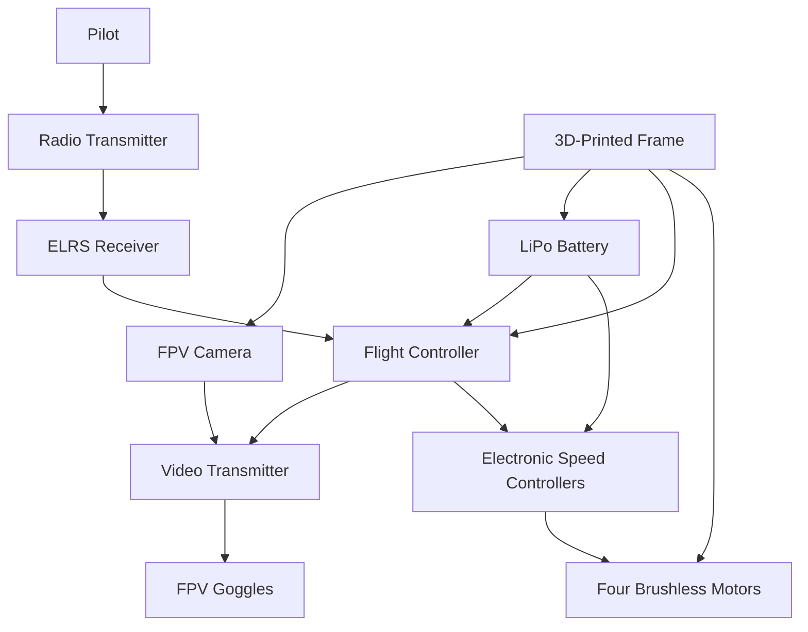

# Mini 3-Inch FPV Drone

A documented engineering project to design, manufacture, assemble, configure, and test a mini 3-inch FPV quadcopter with a primarily 3D-printed airframe.

## Current Project Status

**Phase:** Step 1 — Define the Project  
**Current revision:** Frame V1  
**Frame status:** CAD model completed in Onshape  
**Manufacturing status:** Full Frame V1 print has not yet been completed and validated  
**Flight status:** Not assembled or flight-tested  

Frame V1 must be treated as an **unvalidated prototype** until it passes dimensional inspection, component-fit checks, structural checks, and a complete print test.

## Primary Objectives

- Design a functional 3-inch FPV quadcopter.
- Use an Ender 3 V2 to prototype the frame.
- Learn CAD design, additive manufacturing, electronics integration, soldering, Betaflight configuration, and flight testing.
- Maintain professional engineering documentation throughout the build.
- Create a platform that can later support more advanced embedded-systems and autonomous-drone projects.

## Initial System Architecture

## Repository Structure

- `docs/` — project definition, requirements, architecture, BOM, build log, and test plan
- `cad/` — exported CAD revisions, drawings, screenshots, and Onshape links
- `electronics/` — wiring diagrams, pin maps, and electronics integration notes
- `firmware/` — Betaflight configuration backups and firmware notes
- `manufacturing/` — slicer settings, print profiles, and manufacturing observations
- `tests/` — dimensional, structural, electronics, bench, and flight-test records
- `media/` — labeled photos and videos used in the documentation

## Versioning Rules

- Use `Frame V1`, `Frame V2`, and so on for major geometry revisions.
- Never overwrite an old validated or tested design.
- Record the reason for every revision in `CHANGELOG.md`.
- Export both `.STL` and `.STEP` when a CAD revision is ready for review.
- Use filenames such as:
  - `frame-v1.stl`
  - `frame-v1.step`
  - `frame-v1-top.png`
  - `frame-v1-print-test-2026-07-22.md`

## Immediate Next Actions

1. Add the Onshape document link to `cad/frame-v1/README.md`.
2. Export Frame V1 as STL and STEP files.
3. Record the current Cura settings in the Frame V1 print-settings file.
4. Complete a supervised full print.
5. Inspect and document the printed frame before ordering or mounting components.
6. Update the requirements and BOM as component decisions are made.
