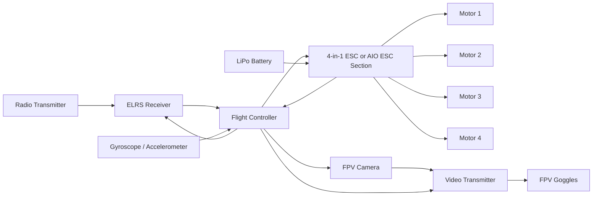

# 01 — System Architecture

## Functional Architecture

## Physical Architecture

### Airframe
- Main frame
- Motor arms
- Electronics mounting area
- Camera mount
- Battery mounting area
- Antenna mounting provisions
- Fasteners and standoffs

### Propulsion
- Four brushless motors
- Four 3-inch propellers
- ESC system
- LiPo battery

### Flight Control
- Flight controller
- IMU
- Betaflight firmware
- Receiver connection
- Motor-output connections

### FPV System
- FPV camera
- Video transmitter
- VTX antenna
- FPV goggles or receiver display

### Ground Control
- ExpressLRS-compatible radio transmitter
- Betaflight Configurator computer
- Battery charger
- Smoke stopper
- Multimeter

## Interface Table

| Source | Destination | Interface | Status |
|---|---|---|---|
| Radio transmitter | ELRS receiver | RF control link | TBD |
| ELRS receiver | Flight controller | UART/CRSF | TBD |
| Flight controller | ESC | Motor signals / onboard AIO connection | TBD |
| ESC | Motors | Three phase wires per motor | TBD |
| FPV camera | Flight controller or VTX | Analog video | TBD |
| Flight controller | VTX | Video and optional control UART | TBD |
| LiPo battery | ESC/AIO | Main battery power | TBD |
| Flight controller | Betaflight computer | USB | Planned |

## Architecture Decision Record

For every major component or architecture choice, record:

- Decision
- Options considered
- Selection criteria
- Final choice
- Reason
- Risks
- Date
