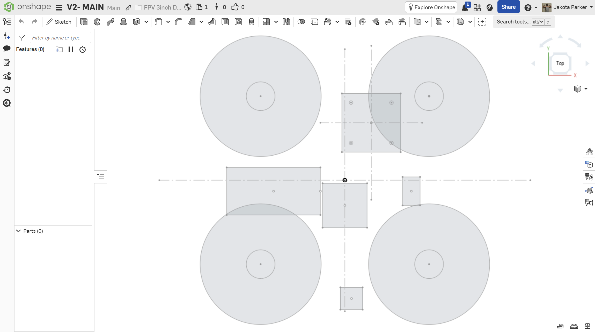
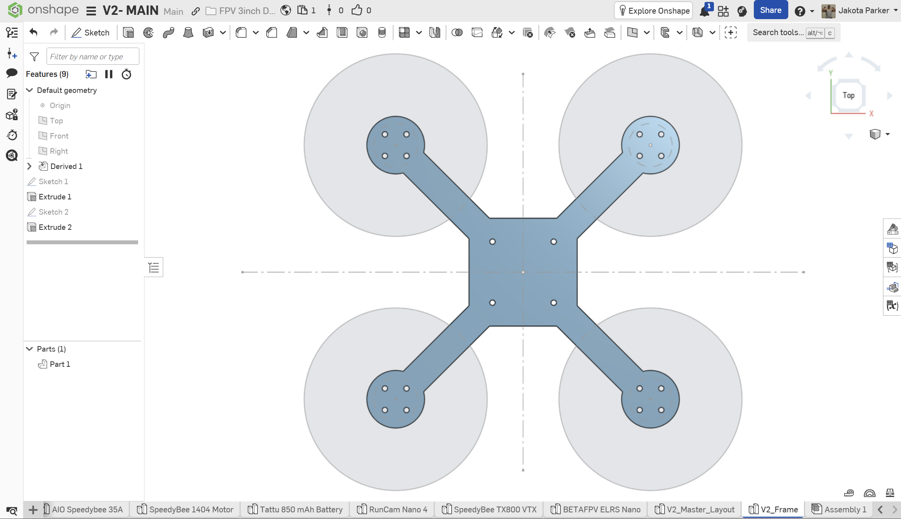
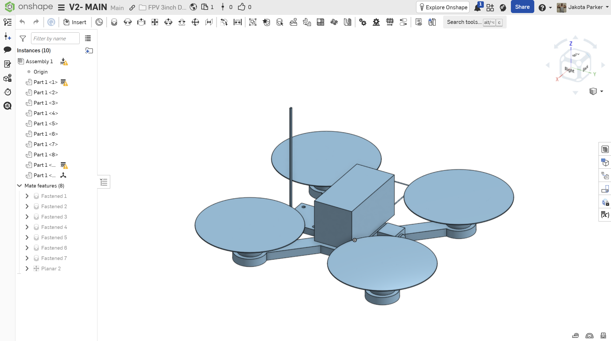

# V2 Frame Design

## Overview

V2 is the first frame revision designed around the actual purchased FPV hardware.

Unlike V1, which was primarily used to establish the basic frame geometry and test the 3D-printing workflow, V2 uses a parametric CAD workflow based on measured component dimensions, mounting patterns, and clearance requirements.

---

## Design Goals

The primary goals for V2 are:

- Design the frame around the actual purchased components
- Maintain clearance for 3-inch propellers
- Create accurate motor and AIO mounting patterns
- Maintain a centralized battery and flight-controller layout
- Provide space for the camera, VTX, receiver, wiring, and antennas
- Keep major dimensions controlled through master parameters
- Make future design changes propagate through the CAD model efficiently

---

## Master Parameter System

A Variable Studio was created in Onshape to control major frame and component dimensions.

Important frame parameters include:

- Wheelbase
- Motor center positions
- Arm width
- Frame center dimensions
- Frame thickness
- Motor pad diameter
- Propeller diameter
- General/component clearances

Component-specific parameters were also added for:

- SpeedyBee 1404 motors
- SpeedyBee F405 AIO
- Propellers

This allows important dimensions to be changed from a central parameter table instead of manually modifying individual sketches.

---

## Component Envelope Models

Simplified envelope models were created to represent the physical space occupied by the purchased components.

Models created:

- `Motor_1404_Envelope`
- `AIO_Envelope`
- `Camera_Envelope`
- `Battery_Envelope`
- `Receiver_Envelope`
- `VTX_Envelope`

These models intentionally omit unnecessary electronic detail and are used for packaging and interference checks.

---

## Master Layout

A master layout was created before redesigning the physical frame.

### Motor Layout

The motor layout defines:

- Four motor center locations
- 150 mm wheelbase
- Motor pad locations
- 3-inch propeller sweep envelopes
- Propeller-to-propeller clearance

### Electronics Layout

The electronics layout was used to estimate the required central packaging area for:

- Flight controller
- Battery
- Camera
- VTX
- ELRS receiver

---

## V2 Frame Geometry

The V2 frame was created using the master layout as a reference.

Current frame features include:

- Central electronics body
- Four integrated arms
- Four circular motor pads
- Motor mounting holes
- AIO mounting holes

### Motor Mounts

The SpeedyBee 1404 motors use a 9 mm square mounting pattern with M2 hardware.

The frame uses clearance holes rather than printed threads. The mounting screws pass through the printed frame and thread directly into the motor.

Motor screw length will be physically verified after the motors arrive to prevent screws from contacting the motor windings.

### AIO Mount

The SpeedyBee F405 AIO uses a:

- 25.5 mm × 25.5 mm mounting pattern
- Four mounting locations

The mounting pattern is centered around the frame origin.

---

## Assembly Packaging Study

A preliminary assembly was created to verify that the purchased components can physically fit within the V2 architecture.

Components currently represented in the assembly:

- V2 frame
- 4 × SpeedyBee 1404 motors
- 4 × 3-inch propeller envelopes
- SpeedyBee F405 AIO
- Tattu 4S 850 mAh battery
- RunCam Nano 4 camera
- SpeedyBee TX800 VTX
- BETAFPV ELRS Nano receiver

### Preliminary Component Placement

**Battery**

The battery is positioned above the central electronics area near the aircraft center of mass.

**AIO**

The AIO is centered on the frame using its 25.5 × 25.5 mm mounting pattern.

**Camera**

The camera is positioned at the front-center of the aircraft between the front arms. The final mount will allow an upward FPV camera angle.

**TX800**

The VTX is positioned toward the rear of the aircraft to provide a short antenna routing path.

**ELRS Receiver**

The receiver is positioned in available space near the rear electronics area. Because of its low mass and small dimensions, it will not drive the overall frame dimensions.

---

## Preliminary Clearance Verification

The assembly was used to check:

- [x] Propeller-to-propeller clearance
- [x] Propeller-to-frame clearance
- [x] Motor mounting alignment
- [x] AIO fit
- [x] Battery footprint
- [x] Camera packaging
- [x] VTX packaging
- [x] Receiver packaging
- [ ] Motor wire routing
- [ ] Camera cable routing
- [ ] VTX wiring
- [ ] Receiver wiring
- [ ] Battery lead routing
- [ ] USB-C access
- [ ] Final antenna routing

---

## Remaining V2 Design Work

Before printing V2:

- [ ] Verify physical component dimensions when parts arrive
- [x] Add battery strap slots
- [x] Design camera mounting interface
- [x] Design VTX retention/mounting
- [x] Design antenna retention
- [x] Determine receiver retention method
- [ ] Verify AIO standoff/grommet requirements
- [ ] Verify motor screw length
- [x] Add structural fillets
- [x] Review arm-to-center stress concentrations
- [x] Review arm-to-motor-pad transitions
- [ ] Evaluate frame thickness and weight
- [ ] Export V2 STEP
- [ ] Export V2 STL
- [x] Print V2 prototype
- [ ] Physically test component fit

---

## Design Status

**V2 Status:** CAD packaging / mechanical design in progress

The major purchased components have been represented in the assembly and preliminary packaging indicates that the current frame architecture is viable.

The next stage is to design the component retention features and refine the frame for its first V2 prototype print.
